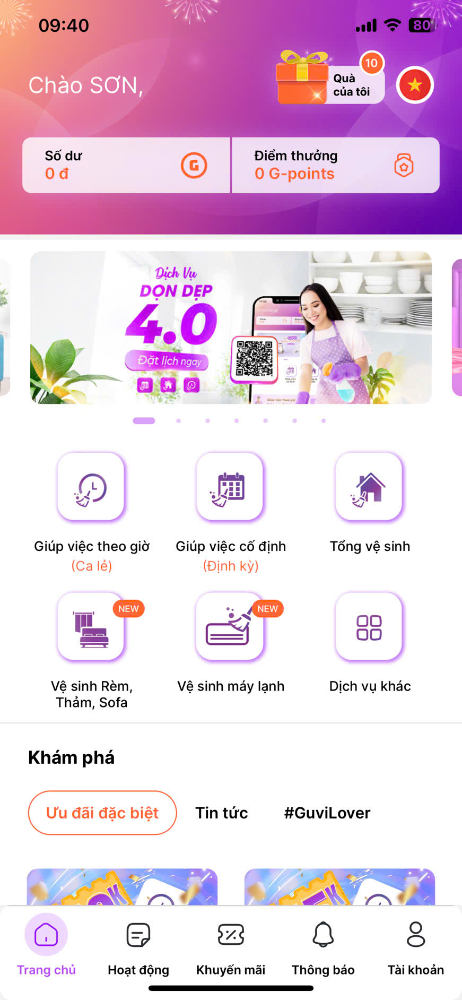

<!-- Improved compatibility of back to top link: See: https://github.com/othneildrew/Best-README-Template/pull/73 -->
<a id="readme-top"></a>
<!-- PROJECT LOGO -->
<br />
<div align="center">
  <a href="https://github.com/othneildrew/Best-README-Template">
    
  </a>
  <h3 align="center">Professional Hourly Maid Service</h3>
  <p align="center">
    <a href="https://github.com/othneildrew/Best-README-Template"><strong>Explore the docs »</strong></a>
    <br />
    <a href="https://github.com/othneildrew/Best-README-Template">View Demo</a>
  </p>
</div>


<!-- TABLE OF CONTENTS -->
<details>
  <summary>Table of Contents</summary>
  <ol>
    <li>
      <a href="#about-the-project">About The Project</a>
      <ul>
        <li><a href="#built-with">Built With</a></li>
      </ul>
    </li>
    <li>
      <a href="#getting-started">Getting Started</a>
      <ul>
        <li><a href="#installation">Installation</a></li>
      </ul>
    </li>
    <li><a href="#contributing">Contributing</a></li>
    <li><a href="#license">License</a></li>
    <li><a href="#contact">Contact</a></li>
  </ol>
</details>


<!-- ABOUT THE PROJECT -->
## About The Project

[![Product Name Screen Shot][product-screenshot]](https://example.com)
<a href="https://example.com">
    
</a>

Guvi is a service-based application that connects customers with workers to
perform cleaning-related tasks. Company staff receive requests and manage operations
through a Customer Relationship Management (CRM) web platform.

<p align="right">(<a href="#readme-top">back to top</a>)</p>


### Built With
* [![React][React.js]][React-url]
* [![JavaScript][JavaScript.com]][JavaScript-url]
* [![Sass][Sass.com]][Sass-url]
* [![Html5][Html5.com]][Html5-url]
* [![Axios][Axios.com]][Axios-url]
* [![Redux][Redux.com]][Redux-url]
* [![Env][Env.com]][Env-url]
<p align="right">(<a href="#readme-top">back to top</a>)</p>


<!-- GETTING STARTED -->
## Getting Started

This is an example of how you may give instructions on setting up your project locally.
To get a local copy up and running follow these simple example steps.

### Prerequisites

This is an example of how to list things you need to use the software and how to install them.
* yarn
  ```sh
  npm install --global yarn
  ```
  
### Installation

_Below is an example of how you can instruct your audience on installing and setting up your app. This template doesn't rely on any external dependencies or services._

1. Clone the repo
   ```sh
   git clone https://github.com/SonDanh2501/GUVI-Web-Admin.git
   ```
2. Install NPM packages
   ```sh
   yarn install
   ```
3. Run the project
   ```sh
   yarn start:admin
   ```

<p align="right">(<a href="#readme-top">back to top</a>)</p>
<!-- CONTRIBUTING -->
## Contributing

### Top contributors:

<a href="https://github.com/SonDanh2501/GUVI-Web-Admin/graphs/contributors">
  
</a>

<p align="right">(<a href="#readme-top">back to top</a>)</p>


<!-- LICENSE -->
## License

Distributed under the Unlicense License. See `LICENSE.txt` for more information.

<p align="right">(<a href="#readme-top">back to top</a>)</p>


<!-- CONTACT -->
## Contact

Danh Truong Son - [Linkedin](https://www.linkedin.com/in/danh-son-5678a2280/) - sondanhwork2501@gmail.com

Project Link: [https://github.com/SonDanh2501/GUVI-Web-Admin](https://github.com/SonDanh2501/GUVI-Web-Admin)

<p align="right">(<a href="#readme-top">back to top</a>)</p>
<!-- MARKDOWN LINKS & IMAGES -->
<!-- https://www.markdownguide.org/basic-syntax/#reference-style-links -->

[contributors-shield]: https://img.shields.io/github/contributors/othneildrew/Best-README-Template.svg?style=for-the-badge
[contributors-url]: https://github.com/SonDanh2501/GUVI-Web-Admin/graphs/contributors
[forks-shield]: https://img.shields.io/github/forks/othneildrew/Best-README-Template.svg?style=for-the-badge
[forks-url]: https://github.com/othneildrew/Best-README-Template/network/members
[stars-shield]: https://img.shields.io/github/stars/othneildrew/Best-README-Template.svg?style=for-the-badge
[stars-url]: https://github.com/othneildrew/Best-README-Template/stargazers
[issues-shield]: https://img.shields.io/github/issues/othneildrew/Best-README-Template.svg?style=for-the-badge
[issues-url]: https://github.com/othneildrew/Best-README-Template/issues
[license-shield]: https://img.shields.io/github/license/othneildrew/Best-README-Template.svg?style=for-the-badge
[license-url]: https://github.com/othneildrew/Best-README-Template/blob/master/LICENSE.txt
[linkedin-shield]: https://img.shields.io/badge/-LinkedIn-black.svg?style=for-the-badge&logo=linkedin&colorB=555
[linkedin-url]: https://linkedin.com/in/othneildrew
[product-screenshot]: src/assets/images/demo.png
[product-app-screenshot]: src/assets/images/demo_app.jpg
[Next.js]: https://img.shields.io/badge/next.js-000000?style=for-the-badge&logo=nextdotjs&logoColor=white
[Next-url]: https://nextjs.org/
[React.js]: https://img.shields.io/badge/React-20232A?style=for-the-badge&logo=react&logoColor=61DAFB
[React-url]: https://reactjs.org/
[Vue.js]: https://img.shields.io/badge/Vue.js-35495E?style=for-the-badge&logo=vuedotjs&logoColor=4FC08D
[Vue-url]: https://vuejs.org/
[Angular.io]: https://img.shields.io/badge/Angular-DD0031?style=for-the-badge&logo=angular&logoColor=white
[Angular-url]: https://angular.io/
[Svelte.dev]: https://img.shields.io/badge/Svelte-4A4A55?style=for-the-badge&logo=svelte&logoColor=FF3E00
[Svelte-url]: https://svelte.dev/
[Laravel.com]: https://img.shields.io/badge/Laravel-FF2D20?style=for-the-badge&logo=laravel&logoColor=white
[Laravel-url]: https://laravel.com
[Bootstrap.com]: https://img.shields.io/badge/Bootstrap-563D7C?style=for-the-badge&logo=bootstrap&logoColor=white
[Bootstrap-url]: https://getbootstrap.com
[JQuery.com]: https://img.shields.io/badge/jQuery-0769AD?style=for-the-badge&logo=jquery&logoColor=white
[JQuery-url]: https://jquery.com 
[Sass.com]: https://img.shields.io/badge/Sass-CC6699?style=for-the-badge&logo=Sass&logoColor=white
[Sass-url]: https://sass-lang.com/
[JavaScript.com]: https://shields.io/badge/JavaScript-F7DF1E?style=for-the-badge&logo=JavaScript&logoColor=000
[JavaScript-url]: https://www.javascript.com/
[Redux.com]: https://img.shields.io/badge/-Redux-black?style=for-the-badge&logo=redux
[Redux-url]: https://redux.js.org/
[Axios.com]: https://img.shields.io/static/v1?style=for-the-badge&message=Axios&color=5A29E4&logo=Axios&logoColor=FFFFFF&label=
[Axios-url]: [https://redux.js.org/](https://axios-http.com/vi/docs/intro)
[Env.com]: https://img.shields.io/badge/.ENV-ECD53F?style=for-the-badge&logo=.env&logoColor=white
[Env-url]: https://www.dotenv.org/docs/
[Html5.com]: https://img.shields.io/badge/html-E34F26?style=for-the-badge&logo=html5&logoColor=white
[Html5-url]: https://developer.mozilla.org/en-US/docs/Glossary/HTML5


